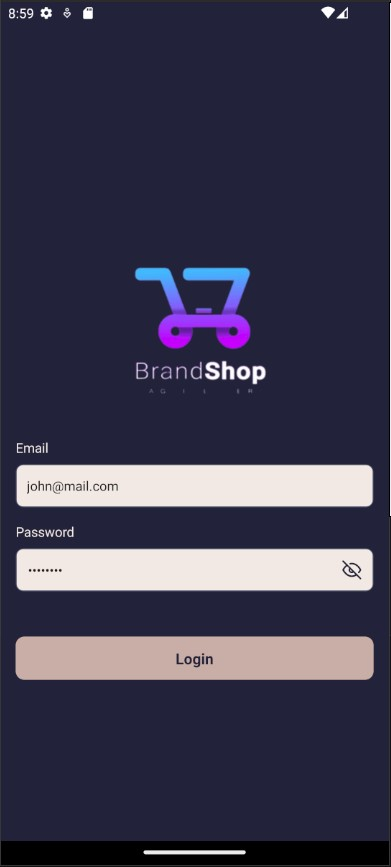
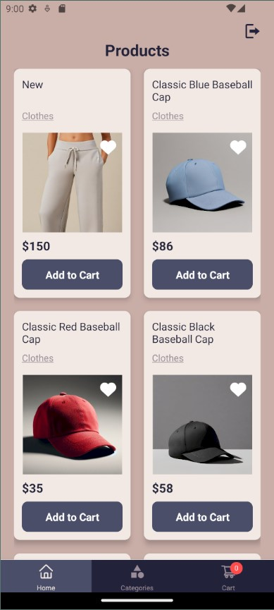
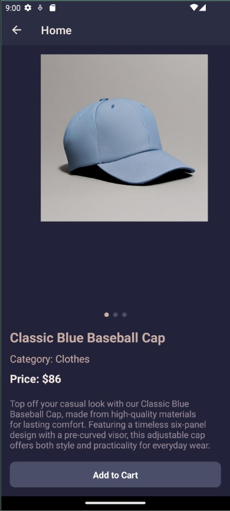
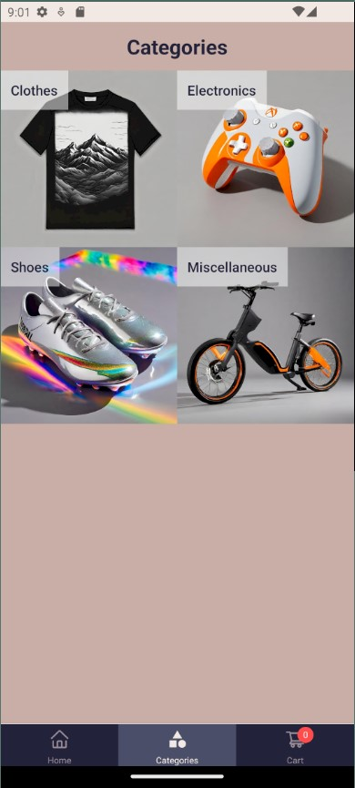
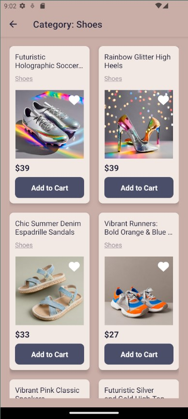
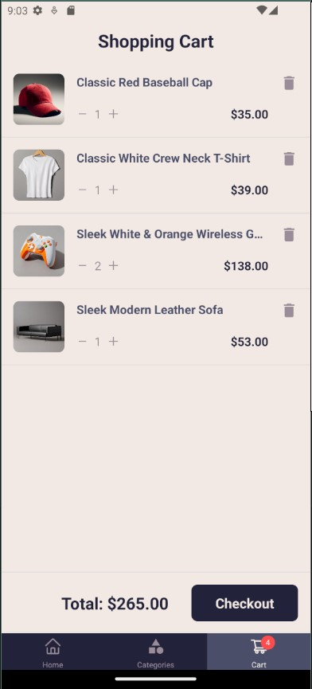

# Expo Project - Category and Product Management App

<div style="display: flex; justify-content: space-between; flex-wrap: wrap;">
  
  
  
  
  
  
</div>
<br/>

This is a mobile app built with **Expo** for managing product categories and viewing products within a selected category. The app fetches categories from an API, allows users to view products in each category, and displays detailed information for each product. It also supports local storage to save and retrieve category data.

## Features

- **Category List**: Displays a list of product categories.
- **Product List**: Displays products for a selected category.
- **Product Details**: Displays detailed information about each product.
- **Local Storage**: Saves category data locally using `AsyncStorage` for offline access.
- **Dynamic Header**: Displays category name dynamically on the product list screen.
- **Navigation**: Uses React Navigation to navigate between screens and pass data (categoryId and categoryName).

## Screens

- **CategoryScreen**: Displays the list of categories fetched from an API or local storage.
- **ProductsScreen**: Displays products for a selected category with dynamic header showing the category name.
- **ProductDetailScreen**: Displays detailed information about a selected product.

## Technologies Used

- **React Native**: For building the mobile app.
- **Expo**: For managing the React Native development workflow.
- **React Navigation**: For handling screen navigation and passing data between screens.
- **AsyncStorage**: For saving category data locally.
- **TypeScript**: For type safety and better development experience.

## Prerequisites

- **Node.js**: Ensure you have [Node.js](https://nodejs.org/) installed.
- **Expo CLI**: If you don't have Expo CLI installed, install it globally using:

  ```bash
  npm install -g expo-cli
  ```
